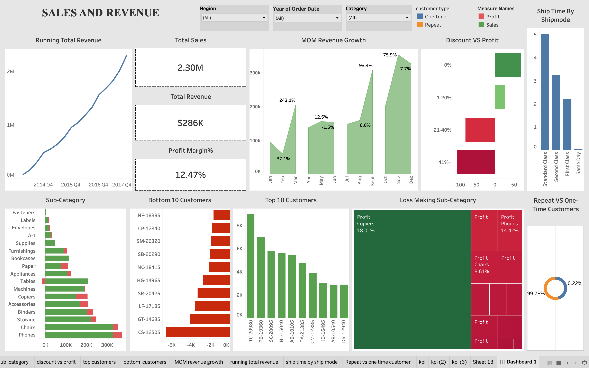

# 📊 Sales and Revenue Analysis Dashboard

This project demonstrates how sales data can be transformed into business decisions using SQL and Tableau. Rather than only visualising data, the dashboard highlights revenue drivers, customer trends, and opportunities for improving profitability.
A business intelligence project built to analyze sales performance, customer behaviour, and revenue trends using Tableau and SQL.

This dashboard transforms raw sales data into actionable business insights, helping decision-makers understand revenue drivers, top-performing products, customer segments, and regional performance.

---

# 📸 Dashboard Preview



---

# 🌐 Interactive Dashboard

👉 **Tableau Public:**  
https://public.tableau.com/views/salesandrevenuedashboard/Dashboard1?:language=en-GB&:sid=&:redirect=auth&:display_count=n&:origin=viz_share_link

---

# 🎯 Business Problem

Businesses generate thousands of sales transactions every month, making it difficult to identify:

- Which products generate the highest revenue
- Which regions perform the best
- Customer purchasing patterns
- Seasonal sales trends
- Opportunities to improve profitability

This dashboard answers these questions through interactive visualizations.

---

# 📂 Dataset

- Superstore Sales Dataset
- Cleaned and transformed before analysis
- Includes sales, customers, products, categories, profit, quantity, discounts, and regions

---

# 🛠️ Tools Used

- Tableau
- SQL
- Microsoft Excel
- Git & GitHub

---

# 📈 Dashboard KPIs

- 💰 Total Sales
- 📦 Total Orders
- 💵 Total Profit
- 📊 Average Sales
- 🛒 Top Selling Category
- 🌍 Regional Performance

---

# 📊 Dashboard Features

- Sales Trend Analysis
- Revenue by Category
- Revenue by Region
- Customer Segment Analysis
- Top Products
- Profit Distribution
- Interactive Filters

---

# 🔍 Key Insights

- Technology generated the highest revenue.
- West region contributed the highest sales.
- Consumer segment accounted for the largest share of revenue.
- A small number of products generated a significant percentage of total sales.
- Discount-heavy orders did not always produce higher profits.

---

# 💡 Business Recommendations

- Increase inventory for high-performing products.
- Reduce excessive discounting on already successful products.
- Focus marketing campaigns on high-value customer segments.
- Improve performance in underperforming regions through targeted promotions.
- Monitor low-profit products and optimise pricing strategy.

---

# 📁 Project Structure

```
Sales-and-Revenue/
│
├── Dashboard/
│   └── Sales_Revenue_Dashboard.twb
│
├── Data/
│   └── superstore_clean.csv
│
├── Images/
│   └── Dashboard.png
│
├── SQL/
│   └── sales_analysis_queries.sql
│
├── README.md
└── .gitignore
```

---

# 🚀 How to Use

1. Download the repository.
2. Open the Tableau workbook.
3. Connect the dataset if prompted.
4. Explore the interactive dashboard.
5. View the Tableau Public dashboard for an online version.

---

# 📌 Skills Demonstrated

- Data Cleaning
- SQL Querying
- Exploratory Data Analysis
- Business Intelligence
- Dashboard Design
- Data Storytelling
- Data Visualisation

---

# 👤 Author

**Punit Kumar**

Mechanical Engineering Undergraduate at DTU | Aspiring Data Analyst

GitHub: https://github.com/punitkumar-dtu
